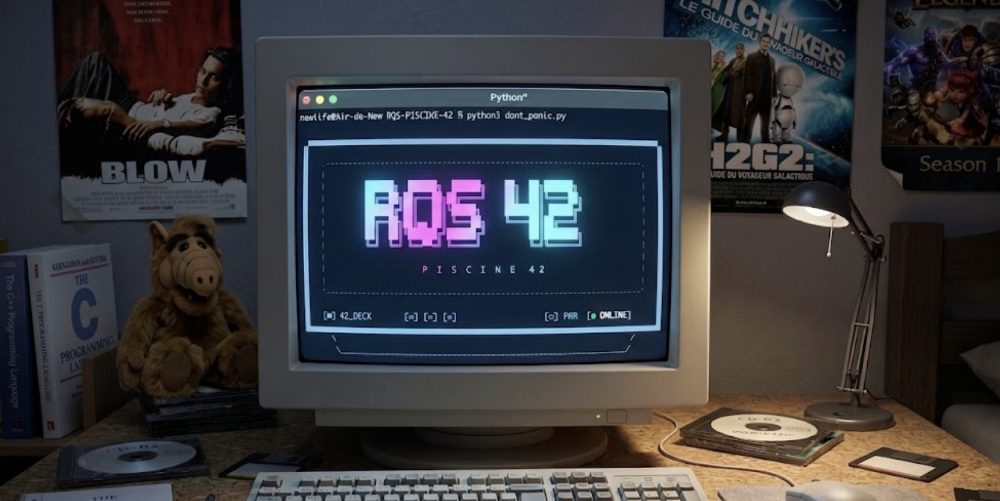

<div align="center">



</div>

<br>

> [!IMPORTANT]
> **Educational & Independent Project**  
> `RQS-PISCINE-42` is an independent student project. It is **not** affiliated with, endorsed by, or an official tool of École 42.  
> It does not contain official exam source code or leak official answers. Exercises are community-sourced approximations designed purely to train your terminal reflexes and C basics.

---

## 📖 Why I Built This

Before starting the 42 Piscine, I had essentially zero experience with C.

During the first exam sessions, I realized how drastically the exam environment differs from solving exercises at home: the strict Git workflow, the isolation, the lack of internet, the ticking clock, and that specific pressure of not knowing whether your code will survive the Moulinette.

One evening, stressing over the upcoming exam, I thought:
> *"What if I had a small local tool to practice taking an exam from start to finish, completely offline?"*

So I started experimenting with the idea, and it quickly got completely out of hand.

What started as a simple way to simulate an exam at home slowly turned into a much bigger project. The simulator now recreates several parts of the exam workflow locally: exercise assignment, the Git submission process, a local Vogsphere-like repository, automated grading, progression between difficulty levels and detailed traces when something goes wrong.


---

## ⚙️ How It Works (The Pipeline)

Most practice tools just test whatever dirty files are sitting in your current folder. That's not how 42 works.

In the real exam, **only what you push to the remote server gets graded**. If you forget to `git add`, `git commit`, or `git push`, you get an instant 0.

This simulator replicates that exact client/server separation locally using a **bare Git repository**:

```
                     ┌──────────────────┐
                     │   Start Exam     │
                     └────────┬─────────┘
                              │
                              ▼
                     ┌──────────────────┐
                     │ Exercise chosen  │
                     └────────┬─────────┘
                              │
                              ▼
                     ┌──────────────────┐
                     │     rendu/       │  <-- You write your .c code here
                     └────────┬─────────┘
                              │
                         git add .
                         git commit -m "submit"
                         git push
                              │
                              ▼
                     ┌──────────────────┐
                     │ Local Vogsphere  │  <-- Bare Git server (server/rendu.git)
                     └────────┬─────────┘
                              │
                           grademe
                              │
                              ▼
                     ┌──────────────────┐
                     │  Isolated Clone  │  <-- Clones fresh from bare repo
                     │   + cc -Wall...  │
                     │   + Unit Tests   │
                     └────────┬─────────┘
                              │
                       ┌──────┴──────┐
                       │             │
                     PASS          FAIL
                       │             │
                       ▼             ▼
                 (Next Level)    (trace/ log generated)
```

When you type `grademe`, the evaluation engine creates a temporary sandbox, clones from the local bare repo, compiles strictly with `cc -Wall -Wextra -Werror`, and tests against multiple edge cases. If it fails, an exact `trace/` file is written to guide your debugging.

---

## ⚡ Core Features

| Module | Description |
| :--- | :--- |
| 🚫 **No Norminette** | In the exam, only your logic and your output matter. The Norminette won't bother you here. Focus on making it work. |
| 🎲 **Improbability Drive** | The engine smoothly assigns exercises based on your current level. Pass, and you move forward; fail, and it gives you another chance to learn. |
| 🧠 **Deep Thought Core** | The built-in Moulinette silently checks your compilation, standard output, and memory. If something breaks, a realistic `trace/` file is generated to help you understand your mistakes. |
| 💾 **Sub-Etha Archiving** | Your sessions and scores are quietly archived in the background, allowing you to track your progress over time. |
| 🔒 **Encrypted Knowledge** | The exercise database (`pool.enc`) is encrypted. No peeking at the answers before you've found the Ultimate Question! |
| ☕️ **Don't Panic UI** | A retro-CRT boot sequence designed to help you relax, take a deep breath, and get into the zone. |

---

## 🚀 Installation & Quick Start

### 1. Clone the repository
```bash
git clone https://github.com/RQS42/RQS-PISCINE-42.git
```

### 2. Enter the directory
```bash
cd RQS-PISCINE-42
```

### 3. Launch the simulator
```bash
python3 dont_panic.py
```
*(On Windows PowerShell, use `python dont_panic.py`)*

### In-Exam Commands:
* `status` / `subject` : View your current assigned problem, level, and points.
* `grademe` : Trigger the Moulinette evaluation on your pushed commit.
* `finish` : End the exam session and generate your recap score.
* `help` : Display all available interactive commands.

---

## 📁 Project Architecture

```text
RQS-PISCINE-42/
│
├── dont_panic.py                   # Universal cross-platform entry point
├── README.md                       # Documentation & philosophy
├── LICENSE                         # MIT License
│
├── data/
│   └── ultimate_question_pool.enc  # Encrypted exercise & test suite
│
├── deep_thought_core/              # Core simulation engine
│   ├── babel_crypto.py             # AES-like stream decryption & RAM loader
│   ├── guide_stats.py              # Performance & session analytics
│   ├── improbability_drive.py      # State machine & exam shell loop
│   ├── moulinette_vogon_auditor.py # Compiler, sandbox & test runner
│   └── sirius_cybernetics_ui.py    # Terminal ASCII rendering & color themes
│
├── vogon_tools/
│   └── vogon_packer.py             # CLI packager for pool exercises
│
└── mice_tests/                     # Internal test suite
    ├── test_crypto.py
    ├── test_moulinette.py
    └── test_stats.py
```

---

## 🎯 What this Project Is — and Isn't

| ✅ What it IS | ❌ What it is NOT |
| :--- | :--- |
| An offline training gym for the Piscine | An official École 42 software |
| A realistic practice tool for Git and C under pressure | A cheat sheet or leak of actual exam content |
| A zero-dependency, open-source personal project | A 1:1 clone of 42's internal server infrastructure |
| A safe space to make mistakes and learn from `trace/` logs | A replacement for peer-learning in the cluster |

---

## 🔮 What's Next? (The Pure C v2.0 Vision)

When I first started building this tool in Python, it was just a quick prototype to help me practice for exams without stressing. But as the project grew, one question kept nagging at me:

> *"If this tool is meant to prepare us for 42, shouldn't it be written in pure C, built like a real Piscine Rush, and 100% Norminette-compliant?"*

That's the ultimate goal for **v2.0**. I want to team up with fellow Pisciners to rebuild the entire simulator from scratch in C99, as a weekend "Rush" project. No Python runtime, no external libraries — just a single, blistering-fast `./dont_panic` binary compiled with `make`.

### 🛠️ The Tech Stack (Under the Hood)

| Module / Feature | POSIX & System Call Magic | What it Does |
| :--- | :--- | :--- |
| 📏 **Strict 42 Norm** | C99 + 42 `norminette` | Zero leaks, max 25 lines/function, 5 functions/file. Fully compliant. |
| ⚙️ **Process Isolation** | `fork()`, `execvp()`, `waitpid()` | Compiles and runs student code in an isolated sandbox so crashes don't kill the shell. |
| ⏳ **Anti-Loop Shield** | `alarm(3)`, `SIGALRM` | Instantly kills infinite loops after 3 seconds without freezing your terminal. |
| 📡 **Output Capture** | `pipe()`, `dup2()` | Intercepts `stdout` and `stderr` to compare student results against references. |
| 🎨 **Terminal TUI** | ANSI TrueColor + `ioctl()` | Auto-detects terminal width and renders retro CRT visuals dynamically. |
| 🔒 **RAM-Only Crypto** | Standalone ChaCha20 Cipher | Decrypts `pool.enc` directly into heap RAM (`malloc`) with zero disk footprint. |
| 📦 **Build System** | Pure GNU `Makefile` | One `make` command to build the entire standalone binary. |


---

## 🤝 Contributing & Peer Spirit

42 is built on peer-to-peer learning. If you spot a bug, want to suggest better edge-case tests, or wish to contribute additional practice problems to the pool:

1. Fork the project & create your branch (`git checkout -b feature/new-exercise`)
2. Commit your improvements (`git commit -m 'Add edge case for ft_split'`)
3. Open a **Pull Request** or submit an **Issue**

---

## 🌟 Credits

A special shoutout to **[mini-moulinette](https://github.com/k11q/mini-moulinette)** by *k11q / khairulhaaziq*. Their work on automated C test cases was a huge source of inspiration for structuring our evaluation engine.

---

## ⚖️ License

Distributed under the **[MIT License](LICENSE)**. Feel free to use, modify, and share it.

<div align="center">
  <br>
  <b><i>Good luck, Pisciner. Don't Panic! 🚀</i></b>
  <br><br>
</div>

<div align="center">
<details>
<summary><b>🥚</b> <i>(Click to expand)</i></summary>

<br>
<i>
Gazing through the window at the world outside<br>
Wondering will mother earth survive<br>
Hoping that mankind will stop abusing her<br>
Sometime<br>
<br>
After all, there's only just the two of us<br>
And here we are, still fighting for our lives<br>
Watching all of history repeat itself<br>
Time after time<br>
<br>
I'm just a dreamer<br>
I dream my life away<br>
I'm just a dreamer<br>
Who dreams of better days<br>
<br>
I watch the sun go down like every one of us<br>
I'm hoping that the dawn will bring a sign<br>
A better place for those who will come after us<br>
This time<br>
<br>
I'm just a dreamer<br>
I dream my life away<br>
Oh, yeah<br>
I'm just a dreamer<br>
Who dreams of better days<br>
<br>
Your higher power may be God or Jesus Christ<br>
It doesn't really matter much to me<br>
Without each other's help, there ain't no hope for us<br>
I'm living in a dream, a fantasy<br>
Oh, yeah-yeah-yeah<br>
If only we could all just find serenity<br>
It would be nice if we could live as one<br>
When will all this anger, hate and bigotry be gone?<br>
<br>
I'm just a dreamer<br>
I dream my life away<br>
Today<br>
<br>
I'm just a dreamer<br>
Who dreams of better days<br>
Oh, yeah<br>
<br>
I'm just a dreamer<br>
Who's searching for the way<br>
Today<br>
<br>
I'm just a dreamer<br>
Dreaming my life away<br>
Oh, yeah-yeah-yeah<br>
</i>
<br>
— <b>Ozzy Osbourne, <i>Dreamer</i></b>

</details>
</div>
